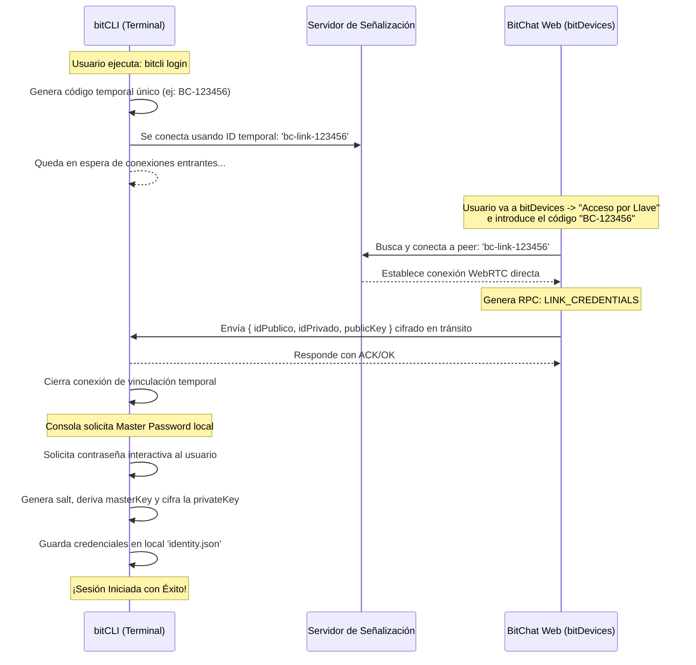

# 🛠️ Arquitectura y Requerimientos: bitCLI

Este documento detalla los requerimientos de diseño, la arquitectura y el conjunto de comandos para **bitCLI**, la herramienta de interfaz de línea de comandos (CLI) nativa diseñada para interactuar localmente con el ecosistema bitOS y BitChat.

---

## 🎯 Objetivo General
Desarrollar una aplicación de consola en Node.js/TypeScript que permita a desarrolladores y usuarios avanzados gestionar identidades, descifrar bases de datos locales, interactuar con el sistema de control de archivos **bitDrive**, y ejecutar nodos de mensajería P2P sin interfaz gráfica.

---

## 🏗️ Arquitectura de la Aplicación

### 1. Stack Tecnológico Propuesto
* **Plataforma:** Node.js (v18+) con TypeScript.
* **Procesamiento de Comandos:** `commander` o `yargs`.
* **Interactividad y UI de Consola:** `clack` (para prompts modernos y spinners) o `inquirer`.
* **Criptografía:** Módulo `crypto` de Node.js (adaptado para replicar con exactitud el comportamiento de la Web Crypto API del navegador).
* **Almacenamiento Local de la CLI:** SQLite (vía `better-sqlite3`) o base de datos de clave-valor compatible con bitDB (JSON/LevelDB).
* **Red P2P:** Cliente WebRTC sin interfaz gráfica (`wrtc` o similar) compatible con PeerJS.

### 2. Capa de Seguridad (Alineación con Seguridad 3.0)
* **Master Password:** Nunca se almacena. Al iniciar comandos sensibles, se solicita la clave en memoria y se deriva la clave de cifrado local mediante **PBKDF2** (100k iteraciones, SHA-256).
* **Compatibilidad de Llavero:** Los comandos criptográficos deben generar y validar llaves sobre la curva elíptica **P-384** (ECDH) e inicializar AES-GCM-256 idénticos al cliente de BitChat.

---

## 🕹️ Especificación de Comandos (CLI Command Tree)

### 1. Gestión de Identidades y Acceso (`bitcli identity`)
Permite manejar identidades, iniciar sesión de forma segura y gestionar claves localmente.
* `bitcli identity create`
  * Crea un par de claves nuevas, solicita contraseña maestra y almacena la clave privada cifrada.
* `bitcli identity show`
  * Muestra el ID público del usuario (`bc-v2-*`), la huella digital (secuencia de 5 emojis) y el código QR de verificación anti-MITM en ASCII.
* `bitcli identity export`
  * Exporta la identidad cifrada a un archivo de respaldo seguro.
* `bitcli identity login` / `bitcli login`
  * Genera un código de acceso único y queda en espera. El usuario introduce este código en la pestaña "Acceso por Llave" del navegador en su `bitDevices`, el cual envía por P2P RPC el `idPublico`, `idPrivado` y su clave pública. Al recibirlos, el CLI solicita la contraseña maestra local para cifrar y guardar la identidad.

### 2. Operaciones de Base de Datos (`bitcli db`)
Permite inspeccionar y manipular los datos de BitChat descifrando la base de datos IndexedDB local.
* `bitcli db unlock --db-path <ruta>`
  * Solicita la contraseña maestra para descifrar y verificar el "Testigo de Autenticación" (Auth Witness).
* `bitcli db query messages --chat <id>`
  * Lista los mensajes del chat descifrando el contenido `msg` en tiempo real.
* `bitcli db query contacts`
  * Muestra la lista de contactos verificados con sus claves públicas asociadas.

### 3. Red P2P y Sincronización (`bitcli peer`)
Permite usar la terminal como un nodo de fondo.
* `bitcli peer daemon`
  * Inicia un nodo persistente en segundo plano que se conecta al broker de señalización.
* `bitcli peer send --to <target-id> --msg <texto>`
  * Realiza el handshake ECDH con el nodo remoto, cifra el mensaje en tránsito (E2EE) y lo envía a través de WebRTC.
* `bitcli peer sync --peer-id <peer>`
  * Envía una petición `SYNC_REQUEST` para sincronizar deltas de mensajes y contactos con un dispositivo autorizado.

### 4. Gestión de Archivos en bitDrive (`bitcli drive`)
Comandos de control de versiones descentralizados locales similares a Git.
* `bitcli drive init --repo-name <nombre>`
  * **Acción:** Crea un nuevo repositorio en la base de datos local SQLite y establece la rama inicial `main`.
* `bitcli drive status`
  * **Acción:** Compara el Working Directory (directorio local en disco) con el commit actual de la rama para listar archivos `Untracked` (no preparados), `Staged` (listos para commit) y `Modified` (modificados).
* `bitcli drive add <archivos...>`
  * **Acción:** Genera los objetos tipo **Blob** de los archivos especificados y los añade a la zona de preparación (staging index).
* `bitcli drive commit -m <mensaje>`
  * **Acción:** Construye los objetos **Tree** y crea el objeto **Commit** inmutable (SHA-256). Actualiza el puntero de la rama activa.
* `bitcli drive log`
  * **Acción:** Muestra el historial de commits, fechas, autores y hashes.
* `bitcli drive clone --repo <repo-id> --from <device-id>`
  * **Acción:** Solicita el clon completo (ramas y base de datos de objetos) de un repositorio a otra terminal autorizada y lo vuelca en el Working Directory local.
* `bitcli drive pull --repo <repo-id> --from <device-id>`
  * **Acción:** Descarga deltas de commits y objetos faltantes de la rama activa desde otra terminal y actualiza el espacio de trabajo.
* `bitcli drive push --repo <repo-id> --to <device-id>`
  * **Acción:** Envía los commits locales y objetos de la rama activa a otra terminal para sincronizar el historial.

---

## 🧭 Estrategia de Gestión de Repositorios en bitDrive

Para sincronizar eficientemente el espacio de trabajo local en disco con el almacenamiento inmutable de `bitDrive`, proponemos la siguiente estrategia de gestión:

### A. Mapeo y Rastreo del Espacio de Trabajo
1. **Metadatos locales (.bitdrive):** Al ejecutar `init`, se crea una carpeta `.bitdrive` en el directorio de trabajo actual. Esta carpeta contiene metadatos de configuración (ID del repositorio, rama activa).
2. **Área de Preparación (Staging Area):** Se utiliza una tabla en la base de datos SQLite cifrada (`git_index`) que contiene registros de tipo `(filePath, hash, timestamp)`. Esto permite comparar rápidamente si un archivo ha sido modificado usando el timestamp de modificación del sistema de archivos, evitando lecturas y cómputos de hash innecesarios.

### B. Flujo de Clonación y Replicación P2P
1. **Solicitud de Clonación:** Al ejecutar `clone`, el CLI contacta con la terminal proveedora mediante un mensaje de protocolo `DRIVE_CLONE_REQ` con el `repoId`.
2. **Reconstrucción del Workspace:** El receptor inserta todos los objetos (`commit`, `tree`, y `blob`) en su base de datos local SQLite y realiza un "Checkout" automático, recreando los directorios y archivos correspondientes en el sistema de archivos del disco local.

---

## ⚡ Solución de Conectividad Node-Navegador (WebRTC RPC)

Node.js carece de una implementación nativa de la pila WebRTC, y librerías antiguas como `wrtc` están obsoletas y presentan fallos al compilar en versiones recientes de Node (como Node v26). Para resolver la comunicación RPC con las terminales web, proponemos tres alternativas de arquitectura:

### Estrategia 1: Puente de Bucle Local (Localhost Bridge - RECOMENDADA)
Si la web app `bitOS` y el CLI `bitcli` se ejecutan en la misma máquina física (localhost):
1. **El CLI actúa como Servidor Loopback:** El comando `bitcli daemon` abre un servidor local HTTP/WebSocket en un puerto local seguro y dinámico.
2. **El Navegador es el Gateway de Red:** Al abrir `bitOS` en el navegador, este detecta la presencia del CLI local (intentando conectar con el puerto dinámico de vinculación) y abre una conexión WebSocket con el demonio del CLI.
3. **Delegación de Señales:** Cuando `bitcli` quiere enviar un mensaje o sincronizar un repositorio con un par externo:
   - Envía el comando al navegador mediante el WebSocket local.
   - El navegador (que tiene la pila WebRTC nativa funcionando) gestiona la conexión PeerJS, envía los datos y reporta los resultados de vuelta al CLI.
   * **Ventaja:** No requiere instalar dependencias nativas complejas en Node y aprovecha al máximo la infraestructura del navegador.

### Estrategia 2: Integración de `node-datachannel`
Si la terminal CLI requiere ejecutarse de forma totalmente autónoma (Headless) en servidores o entornos remotos sin un navegador web local activo:
- **Implementación:** Utilizar **`node-datachannel`** (bindings de Node.js para la biblioteca C++ `libdatachannel`).
- **Ventaja:** Está activamente mantenida, se compila sin problemas en Node v26 y provee soporte nativo para WebRTC Data Channels (perfecto para la transferencia de repositorios y mensajes).

### Estrategia 3: Companion en Segundo Plano (Headless Browser)
- **Implementación:** Al ejecutar el demonio de fondo, `bitcli` levanta una instancia invisible de Chromium (mediante `puppeteer` o `playwright`).
- **Funcionamiento:** Esta instancia carga una página minimalista de `bitOS` que actúa como motor WebRTC, comunicándose con el proceso principal de Node.js a través de variables expuestas o eventos `exposeFunction`.

---

## 📅 Plan de Desarrollo e Implementación

### Fase 1: Criptografía y Configuración Base (Semana 1)
* Estructurar el proyecto Node.js/TS.
* Migrar wrappers de criptografía desde `src/sdk/services/crypto.ts` hacia `bitcli-crypto` usando el módulo `crypto` de Node.
* Implementar comandos base de `identity`.

### Fase 2: Motor de bitDrive (Semana 2)
* Implementar el motor de almacenamiento local en formato de objetos direccionados por hash (Git-like: Blobs, Trees, Commits).
* Programar comandos `bitcli drive init/add/commit/log`.

### Fase 3: Networking y Daemon (Semana 3)
* Implementar la pila PeerJS/WebRTC compatible con Node.
* Desarrollar el flujo de handshake E2EE para `peer daemon` y `peer send`.
* Integrar el motor de replicación por deltas.

### Fase 4: Integración y Pulido (Semana 4)
* Validar que la encriptación local y de tránsito sea 100% interoperable con el cliente web de BitChat/bitOS.
* Diseñar la UI interactiva final con clack/inquirer.

---

## 🔗 Protocolo de Vinculación: Acceso por Llave (Key Access)

Para vincular de forma segura una terminal `bitCLI` sin copiar credenciales manualmente:

1. **Generación del Código:** El código temporal es un identificador aleatorio de baja entropía pero de corta duración (ej. 6 dígitos o caracteres alfanuméricos) que sirve para registrarse de forma temporal en el servidor de señalización bajo un prefijo seguro (ej. `bc-link-[CODIGO]`).
2. **Conexión Temporal:** `bitCLI` se suscribe a este ID temporal. Al mismo tiempo, el navegador del usuario se conecta a ese mismo ID temporal.
3. **RPC `LINK_CREDENTIALS`:** A través de la conexión directa WebRTC, el navegador inicia un handshake e inmediatamente envía las credenciales del usuario actual (ID público, ID privado, y clave pública JWK).
4. **Cifrado Final:** El CLI recibe las claves crudas del navegador, corta la conexión WebRTC temporal, y pide al usuario ingresar la contraseña con la que desea cifrar sus credenciales localmente en el CLI.

